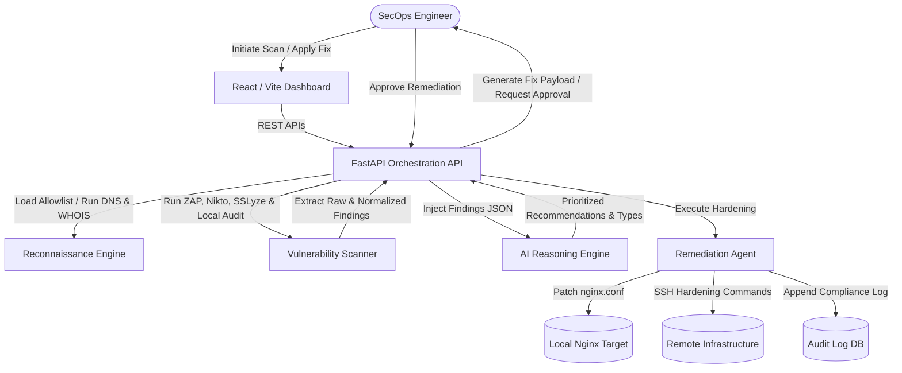

# Sentinel AI

### **"The World's First AI Security Co-Pilot that Thinks, Hunts, and Heals — Autonomously"**

[](https://opensource.org/licenses/MIT)
[](#)
[](#)
[](#)
[](#)
[](#)

---

Sentinel AI is an autonomous, agentic AI Security Co-Pilot designed to secure target infrastructures. Built for modern SecOps teams, it automates domain reconnaissance, triggers deep security vulnerability scans, conducts advanced reasoning on telemetry data using large language models, and generates and applies immediate security remediation actions (Self-Healing). 

## 🚨 The SecOps Problem

Modern security operation centers (SOCs) are overwhelmed by:
* **Alert Fatigue:** SecOps teams receive thousands of disconnected alerts daily, leading to missed critical findings.
* **Fragmented Tooling:** Network reconnaissance, vulnerability scanning, and configuration updates are handled by siloed, non-communicative applications.
* **Slow Incident Response:** The gap between vulnerability detection, risk prioritization, and configuration hardening is measured in days, leaving window-of-exposure vulnerabilities open.
* **Complex Remediation:** Rewriting complex system and web server configurations manually introduces manual error risk and slows down mitigation.

## 🛡 The Sentinel AI Solution

Sentinel AI unifies the entire security lifecycle (**Hunt, Think, and Heal**) into a single, closed-loop orchestrator. It bridges the gap between identification and remediation from days to milliseconds.

```
+-------------------------------------------------------+
|  [ HUNT ] Domain Recon & Multi-Engine Vulnerability Scan |
+---------------------------+---------------------------+
                            | (Telemetry Payload)
                            v
+-------------------------------------------------------+
|  [ THINK ] Agentic LLM Reasoning, Scoring & Recommendation|
+---------------------------+---------------------------+
                            | (Remediation Payload)
                            v
+-------------------------------------------------------+
|  [ HEAL ] Self-Healing Agent applied to Target Configs  |
+-------------------------------------------------------+
```

---

## ⚙ Core Capabilities

### 🔍 1. Hunt (Autonomous Discovery)
* **Active Domain Reconnaissance:** Leverages `dnspython`, WHOIS services, and SSL certificate analyzers to map host architecture, certificates, and DNS records.
* **Scope-Restricted Scanning:** Restricts vulnerability scans strictly to allowed target domains (managed via target allowlists).
* **Multi-Engine Telemetry:** Aggregates findings from active network scanning adapters (ZAP, Nikto, SSLyze) combined with custom system configuration checkers.

### 🧠 2. Think (Agentic AI Reasoning)
* **LLM Threat Analysis:** Translates complex scanner output messages into human-interpretable logs.
* **Root-Cause Profiling:** Discovers underlying system misconfigurations (e.g. legacy TLS handshakes, missing response headers, exposed server information).
* **Remediation Mapping:** Automatically generates structured patch actions mapped to remediation engine types (`header_hardening` / `tls_hardening`).

### 🛠 3. Heal (Self-Healing Engine)
* **Config Hardening:** Directly rewrites web server configuration templates (`nginx.conf`) to patch insecure headers and disable weak cipher suites.
* **Closed-Loop Verification:** Executes post-remediation scans to confirm that config patches successfully resolved the findings.
* **Audit Trails:** Logs every step of the remediation lifecycle (actions taken, modified directives, statuses, and timestamps) for forensic compliance.

---

## 📐 Architecture

Sentinel AI coordinates scanning, AI reasoning, and server hardening through a centralized orchestration engine.



---

## 🛠 Tech Stack

| Layer | Technologies | Role / Impact |
|---|---|---|
| **Frontend** | React, Vite, React Router, Vanilla CSS | Premium dark-themed, glassmorphic UI displaying real-time task progress, vulnerability findings, and recommendations. |
| **Backend** | FastAPI, Python | High-performance API orchestration server coordinating asynchronous worker threads. |
| **Recon Engine** | `dnspython`, `python-whois` | Automates active information gathering, records registry, and DNS records checking. |
| **Scanner Engine** | OWASP ZAP, Nikto, SSLyze, Local Audit | Performs deep packet analysis, header audits, and SSL cipher scanning. |
| **Remediation Agent** | Paramiko (SSH), Regex Config Editor | Updates local/remote files securely and pushes hardened parameters. |
| **AI Layer** | OpenAI APIs / Claude Mock Services | Formulates plain-text explanation logs and maps vulnerability signatures to structured remediation directives. |

---

## 📁 Project Structure

```
sentinel-ai/
├── backend/                     # Python FastAPI Backend Services
│   ├── sentinel/
│   │   ├── api/                 # FastAPI REST Endpoints & Routers
│   │   │   ├── main.py          # FastAPI App Entrypoint
│   │   │   ├── dependencies.py  # Service dependency injectors
│   │   │   ├── exceptions.py    # Custom mapped API HTTP exceptions
│   │   │   ├── routers/         # Endpoint routing (scan.py, report.py)
│   │   │   ├── schemas/         # Pydantic schemas (scan.py, report.py)
│   │   │   └── services/        # Orchestration services (scan_service.py)
│   │   ├── recon/               # Recon Service (DNS, WHOIS checks)
│   │   ├── scanner/             # Vulnerability Scanner Service
│   │   ├── remediation/         # Remediation Service (Nginx hardening)
│   │   ├── reporting/           # Report Service (PDF generation)
│   │   ├── ai_analysis/         # AI analysis mapper service
│   │   └── core/                # Core helper utilities
├── frontend/                    # React Vite Frontend Application
│   ├── src/
│   │   ├── components/          # Reusable UI components
│   │   ├── pages/               # Views (HomePage, ScanPage, ResultsPage, etc.)
│   │   ├── services/            # API connection adapters
│   │   ├── App.jsx              # Main App wrapper and router
│   │   └── main.jsx             # React mount node
├── sample_target/               # Intentionally Vulnerable Target Environment
│   ├── nginx.conf               # Vulnerable configuration containing weak TLS & missing headers
│   ├── allowlist.txt            # Controlled-target allowed domain configuration
│   └── site/                    # Target web assets
├── scripts/                     # Operational execution helpers
│   ├── verify_system.py         # End-to-end integration verifier
│   ├── run_scanner.py           # CLI vulnerability scanner script
│   └── run_remediation.py       # CLI remediation script
├── tests/                       # Integration & Unit Test Suites
│   ├── integration/             # Integration tests (vulnerability remediation lifecycle)
│   └── unit/                    # Core service tests
├── requirements.txt             # Backend dependencies
└── package.json                 # Frontend dependencies
```

---

## 🚀 Installation & Setup

### Prerequisites
* Python 3.10 or higher
* Node.js v18 or higher

### 1. Clone the Repository
```bash
git clone https://github.com/your-username/sentinel-ai.git
cd sentinel-ai
```

### 2. Backend Setup
Create a Python virtual environment and install the required modules:
```bash
# Create virtual environment
python -m venv venv
source venv/bin/activate  # On Windows: venv\Scripts\activate

# Install dependencies
pip install -r requirements.txt
```

### 3. Frontend Setup
Navigate to the frontend folder and install npm packages:
```bash
cd frontend
npm install
cd ..
```

---

## 🔑 Environment Variables

Create a `.env` file in the root directory:
```env
# Server Binding
FASTAPI_HOST=127.0.0.1
FASTAPI_PORT=8000

# Target Scope Configurations
TARGET_ALLOWLIST=example.team-owned-site.com

# Scanners Paths & URLs
ZAP_API_URL=http://localhost:8080
NIKTO_PATH=/usr/bin/nikto
REPORTS_PATH=./reports

# Remediation Credentials
SSH_TIMEOUT_SECONDS=10
```

---

## 🏃 Running Locally

### 1. Start Backend FastAPI Server
Run the FastAPI application from the project root:
```bash
# Set Python path to ensure backend imports resolve
set PYTHONPATH=.
python backend/sentinel/api/main.py
```
*Backend API docs will be available at: http://localhost:8000/docs*

### 2. Start Frontend Server
Navigate to the frontend folder and run the dev script:
```bash
cd frontend
npm run dev
```
*Frontend interface will be available at: http://localhost:5173 (or http://localhost:3000)*

### 3. CLI Operational Execution
You can also scan and patch targets directly from the command line:
```bash
# Run vulnerability scanning
python scripts/run_scanner.py example.team-owned-site.com

# Run remediation (dry-run mode)
python scripts/run_remediation.py example.team-owned-site.com
```

---

## 📡 API Overview

| Method | Endpoint | Description | Payload Sample | Response Status |
|---|---|---|---|---|
| **POST** | `/api/scan/initiate` | Initiates scan task for domain | `{"domain": "example.team-owned-site.com", "scanProfile": "full-scan"}` | `200 OK` (returns task ID) |
| **GET** | `/api/scan/{task_id}/status` | Retrieves orchestration progress | *None* | `200 OK` (returns progress & status) |
| **GET** | `/api/scan/{task_id}/results`| Fetches scan findings & AI recommendations | *None* | `200 OK` (returns findings list) |
| **POST** | `/api/scan/{task_id}/fix` | Resolves specified vulnerability recommendation | `{"action": "fix", "recommendationId": "r-001"}` | `200 OK` (returns scheduled state) |
| **POST** | `/api/report/{task_id}/generate` | Compiles forensic scan & remediation PDF report | *None* | `200 OK` (returns report url) |

---

## ⚔️ Why Sentinel AI Is Different

| Metric | Traditional Security Tools (ZAP, Nikto, etc.) | Sentinel AI Co-Pilot |
|---|---|---|
| **Remediation Gap** | Manual creation of issues, slow handoff to sysadmins. | **Autonomous Config Generation** and direct patch writing. |
| **Threat Context** | Hundreds of text lines with no semantic prioritization. | **Agentic Reasoning** explaining threat severity in plain language. |
| **Scanning Verification**| Manual validation required to check if a fix resolved the alert. | **Closed-loop verification** automatically rescanning targets. |
| **Infrastructure Protection**| High risk of running scans on unauthorized assets. | **Strict Allowlist Scope Enforcement** avoiding illegal scans. |

---

## 🚀 Hackathon Value Proposition

### 💡 Innovation
Sentinel AI replaces the typical disjointed workflow of security auditing. Instead of running a scanner, copy-pasting alerts into an LLM, and manually scripting fixes, Sentinel AI implements an **autonomous SecOps loop**. It couples discovery (`recon` + `scanner`), intelligence (`AI analysis`), and action (`remediation agent`) into a single state machine.

### 📈 Scalability
The architecture isolates scanners, host verifiers, and remediation engines behind cleanly-defined service interfaces. Scanning and remediation jobs execute asynchronously in backend daemon threads, preventing API blockage and allowing smooth scaling of background queue systems.

### 🛠 Technical Complexity
* **Configuration Syntax Rewriter:** Employs regex and block parsers to safely modify `nginx.conf` parameters without corrupting structure.
* **Dual Audit Fallback:** Supports offline/local testing by checking config file state statically if the docker target engine is not dynamically reachable.
* **Type-Based Action Router:** Maps polymorphic AI analysis structures directly to active system commands or file edit tasks.

---

## 🛣 Future Roadmap

1. **Kubernetes CRD Operator Integration:** Develop a Kubernetes Custom Resource Definition (CRD) operator to auto-remediate pods with bad configurations.
2. **Real-time Threat Feeds Sync:** Integrate with active threat intelligence feeds (AlienVault OTX, MISP) to dynamically update scanning priorities.
3. **Advanced WAF Rule Generation:** Automatically output Cloudflare or AWS WAF rule sets alongside server configuration templates.
4. **GitOps Integration (GitHub Actions):** Push configuration fixes to repository pull requests (`git commit` + PR creation) instead of raw server edits.
5. **Interactive Attack Path Mapping:** Show structural graphs showing how an attacker can leverage multiple minor vulnerabilities (chaining).
6. **Multi-Host SSH Hardening Orchestrator:** Support parallel host scanning and remediation execution on larger EC2/VM server arrays.
7. **OAuth SecOps Single-Sign-On:** Add enterprise identity logins (Okta, Azure AD) for auditing fix execution requests.
8. **Compliance Framework Reporting:** Map scan findings and applied fixes directly to regulatory structures like SOC2, ISO27001, and PCI-DSS.

---

## 👥 Contributors

* **SecOps Engineer (Person A)** - Core scanning, configuration editing, system validation integration, and test lifecycle execution.

---

## 📄 License

This project is licensed under the MIT License - see the [LICENSE](LICENSE) file for details.
